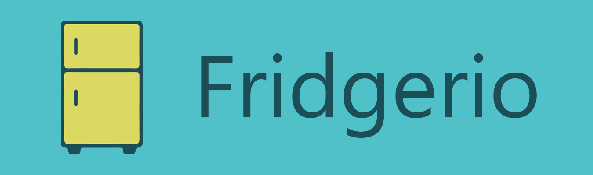

# Fridgerio Landingpage

 

---

 &nbsp; [fridgerio.peter-stuhlmann.now.sh](https://fridgerio.peter-stuhlmann.now.sh)

---

## License

### Code

The code is licensed under the [MIT](https://github.com/peter-stuhlmann/Fridgerio-Landingpage/blob/master/LICENSE) License.

### Images

 The Fridgerio logo (designed by Peter R. Stuhlmann) is licensed under a <a rel="license" href="http://creativecommons.org/licenses/by-nc-nd/4.0/">Creative Commons Attribution-NonCommercial-NoDerivatives 4.0 International License</a>.

The smartphone image (without the Fridgerio logo) by <a href="https://pixabay.com/users/OpenClipart-Vectors-30363/?utm_source=link-attribution&amp;utm_medium=referral&amp;utm_campaign=image&amp;utm_content=160307">OpenClipart-Vectors</a> is licensed under the <a href="https://pixabay.com/service/license/">Pixabay License</a>.

The FontAwesome icons are licensed under <a href="https://creativecommons.org/licenses/by/4.0/">Creative Commons Attribution 4.0 International</a>.

Apple, the Apple logo, iPhone, and iPad are trademarks of Apple Inc., registered in the U.S. and other countries and regions. App Store is a service mark of Apple Inc.

Google Play and the Google Play logo are trademarks of Google LLC.

---

[&copy; Peter R. Stuhlmann Webentwicklung](https://peter-stuhlmann-webentwicklung.de). All rights reserved.